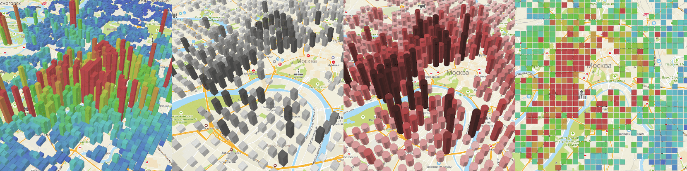

# heatmap-bars

Plugin to add heatmap bars to your 2GIS MapGL map.



See demo examples:

-   [Default view](https://trufi.github.io/heatmap-bars/)
-   [Black-white grid](https://trufi.github.io/heatmap-bars/?lng=37.6233&lat=55.7353&zoom=12.42&rotation=-31.58&pitch=30.52&size=0.65&height=81682&hueOfMinValue=0&saturationOfMinValue=0&lightOfMinValue=1&saturationOfMaxValue=0&lightOfMaxValue=0.28&lightInfluence=0.49)
-   [Red circles](https://trufi.github.io/heatmap-bars/?lng=37.5881&lat=55.7260&zoom=11.61&rotation=-16.88&pitch=28.41&size=0.78&height=202998&faces=8&hueOfMinValue=0&lightOfMinValue=0.89&lightOfMaxValue=0.16)
-   [Flat grid](https://trufi.github.io/heatmap-bars/?lng=37.6115&lat=55.7526&zoom=11.92&rotation=0.45&pitch=0&size=1.27&height=0)
-   [Blue-red circles](https://trufi.github.io/heatmap-bars/?lng=37.6385&lat=55.6867&zoom=11.52&rotation=25.37&pitch=39.47&size=0.51&height=150000&faces=6&adaptiveViewportPallete=0&radius=50000)

## Using

Install with npm:

```bash
npm install @trufi/heatmap-bars
```

Then initialize with passing MapGL Map object:

```js
import { load } from '@2gis/mapgl';
import { Heatmap } from '@trufi/heatmap-bars';

load().then((mapgl) => {
    // Initialize MapGL map
    const map = new mapgl.Map('map', {
        center: [82.920412, 55.030111],
        zoom: 15,
        key: 'YOUR MAPGL API KEY',
    });

    // Initialize heatmap bars
    const heatmap = new Heatmap(map, 'map');

    // Change heatmap options on the fly
    heatmap.setOptions(heatOptions);

    // Set data as number[][] grid
    heatmap.setData(points);
});
```
